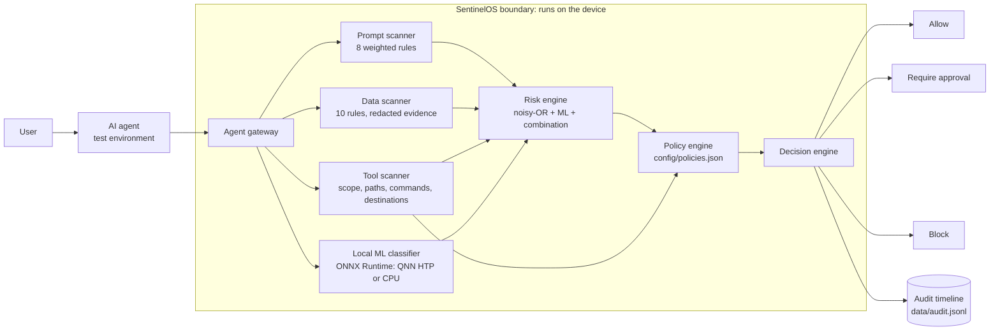

# Architecture

SentinelOS sits between an AI agent and the things it can touch. Every request the
agent makes (the user's prompt, the content it has read, and the action it wants to take)
passes through one gateway and receives one of three decisions: allow, require approval,
or block.

## Components

| Component | File | Responsibility |
|---|---|---|
| Agent gateway | `sentinel/gateway.py` | Single entry point. Runs every stage, times each one, assembles the explanation, writes the audit record. |
| Prompt scanner | `sentinel/security/prompt_scanner.py` | Weighted rule categories for instruction override, system-prompt extraction, role hijack, guardrail bypass, instruction smuggling, covert action, exfiltration directives and scope escalation. Untrusted context is weighted higher than trusted context. |
| Data scanner | `sentinel/security/data_scanner.py` | Private keys, cloud keys, API tokens, credential assignments, Luhn-valid card numbers, national-ID formats, IBAN-like accounts, email, phone, confidentiality markers. Secret-class evidence is redacted before it leaves the scanner. |
| Tool scanner | `sentinel/security/tool_scanner.py` | Infers scope (file, directory, recursive, profile, drive), checks sensitive paths, workspace boundaries, blocked command patterns, network allowlist and external email recipients. Flags broad requests with vague justifications. |
| Local ML classifier | `sentinel/inference/classifier.py` | DistilBERT prompt-injection classifier on ONNX Runtime. Tries the QNN HTP (NPU) backend with CPU fallback disabled; falls back to CPU and records why. Pure-Python WordPiece tokenizer (`tokenizer.py`) avoids native tokenizer wheels. |
| Risk engine | `sentinel/security/risk_engine.py` | Explainable scoring; see [risk-model.md](risk-model.md). |
| Policy engine | `sentinel/security/policy_engine.py` | Loads `config/policies.json`; cross-cutting rules (tool after injection, secrets leaving the device, secrets in context). |
| Decision engine | `sentinel/security/decision_engine.py` | Most severe of the level-mapped decision and all policy verdicts. Policies can only tighten. |
| Audit timeline | `sentinel/audit.py` | In-memory timeline plus append-only JSONL; approve/deny for held requests. |
| Agent simulator | `sentinel/simulator/presets.py` | Agent Security Test Environment: five deterministic synthetic scenarios. Tools are simulated, never executed. |
| Server | `sentinel/server.py` | Python standard-library HTTP server bound to `127.0.0.1`. Serves the API and the built UI. |
| UI | `app/frontend/` | React + TypeScript. Overview, Agent console, Threats, Policies, Benchmarks, and a trust graph drawn from each event's real scores. Fonts are bundled, so the UI needs no network. |

## Design decisions

**Hybrid detection.** Deterministic rules give repeatable, explainable results and cover
tool and data risk, which a text classifier cannot. The ML classifier adds a second opinion
on injection wording the rules may miss. The ML contribution is capped so the model alone can
escalate a request to review but cannot block it (see risk-model.md). This is a deliberate
guard against classifier false positives interrupting legitimate work.

**Standard library for the core.** The security engine and server have no third-party
dependencies. On Windows ARM64 this removes the most common installation failures, and it
means the deterministic engine runs on any machine with Python 3.10+.

**Honest runtime reporting.** Every runtime value shown in the UI (model, provider,
accelerator, load time, network) is read at runtime. "NPU" is shown only when a QNN HTP
session was created with CPU fallback disabled.

## API

| Method | Path | Purpose |
|---|---|---|
| GET | `/api/status` | Model, runtime, provider, accelerator, machine, network, NPU verification record |
| GET | `/api/presets` | Demo scenarios |
| POST | `/api/analyze` | Run a security check on `{prompt, context, context_source, tool_request}` |
| GET | `/api/events` | Audit timeline and counts |
| POST | `/api/events/{id}/resolve` | `{action: "approve" | "deny"}` for held requests |
| GET | `/api/policies` | Active policy file |
| GET | `/api/benchmark` | Latest `docs/benchmark-results.json` |
